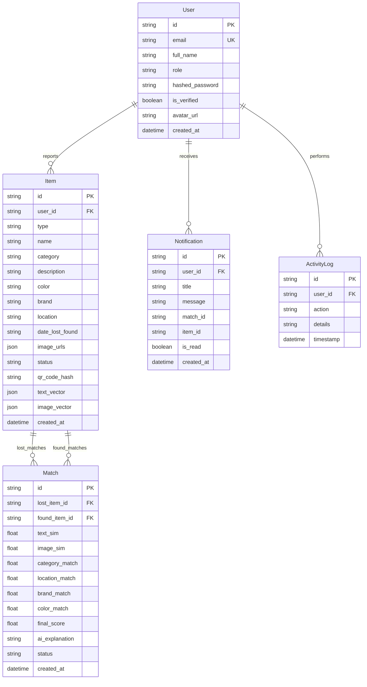

# AI Lost & Found Assistant

Production-ready, full-stack AI-powered Lost & Found platform built with **React + Vite**, **FastAPI**, **SQLite/PostgreSQL**, **JWT Authentication**, and a **6-Factor Multimodal AI Matching Engine** (SentenceTransformers + OpenCLIP + FAISS / Scikit-Learn vector similarity search).

---

## 🌟 Key Features

1. **Authentication & Roles**: JWT authentication, bcrypt password hashing, student/employee registration, admin office privileges.
2. **Interactive User Dashboard**: Real-time stats overview, lost/found items grid, recent activity feed, global multi-attribute search & filters.
3. **Multi-Attribute Item Reporting**: Report lost & found items with Name, Category, Description, Color, Brand, Location, Date, Additional Notes, and Drag-and-Drop Multi-Image Uploads.
4. **6-Factor AI Matching Engine**:
   - Dense vector text embeddings (`SentenceTransformers` `all-MiniLM-L6-v2`)
   - Deep image visual feature embeddings (`OpenCLIP` / feature extraction)
   - Cosine & vector distance calculation
   - **Exact Formula**:
     $$\text{Final Score} = 0.45 \cdot \text{TextSim} + 0.30 \cdot \text{ImageSim} + 0.10 \cdot \text{Category} + 0.05 \cdot \text{Location} + 0.05 \cdot \text{Brand} + 0.05 \cdot \text{Color}$$
5. **Smart Notifications**: Automatic in-app and email notification dispatch when confidence score exceeds **80%**.
6. **QR Code Verification**: QR code generation for every reported item to verify ownership at campus lost & found office counters.
7. **Admin & Operations Console**: Analytics metrics, daily reports area charts (Recharts), top lost categories bar graphs, match confirmation queue, item returned toggles, activity audit logs.
8. **Modern Aesthetic UI/UX**: Dark/Light mode theme toggle, glassmorphic cards, responsive sidebar layout, smooth visual gauges.

---

## 📐 Database ER Diagram



---

## 🔌 API Documentation

| Endpoint | Method | Description |
| :--- | :--- | :--- |
| `/api/auth/register` | `POST` | Register a new user account |
| `/api/auth/login` | `POST` | Authenticate user & return JWT token |
| `/api/auth/me` | `GET` | Get current user profile |
| `/api/items` | `POST` | Report a lost or found item with image uploads |
| `/api/items` | `GET` | Browse items with search & category filters |
| `/api/items/{id}` | `GET` | Get detailed item record |
| `/api/matches` | `GET` | Get ranked AI candidate matches for current user |
| `/api/matches/run-search/{id}` | `POST` | Run real-time AI vector search for specific item |
| `/api/matches/{id}/status` | `PUT` | Confirm or reject candidate match |
| `/api/notifications` | `GET` | List notifications for current user |
| `/api/notifications/{id}/read`| `PUT` | Mark notification as read |
| `/api/admin/analytics` | `GET` | Fetch admin metrics & graph analytics |
| `/api/admin/items` | `GET` | Admin view of all items |
| `/api/admin/items/{id}/returned` | `PUT` | Mark item status as returned to owner |
| `/api/admin/activity-logs` | `GET` | Retrieve system audit logs |

---

## 🛠️ Quick Start Guide

### Prerequisites
- Python 3.13 / Python 3.10+
- Node.js 18+ / 20+

### 1. Run Backend Server
```bash
# Navigate to project root
cd "c:\Users\alekh\OneDrive\Pictures\Desktop\ai lost and found assistant"

# Install backend dependencies
python -m pip install -r backend/requirements.txt

# Start FastAPI Uvicorn Server
$env:PYTHONPATH="."
python -m uvicorn backend.main:app --host 0.0.0.0 --port 8000 --reload
```
API Documentation available at: `http://localhost:8000/docs`

### 2. Run Frontend Web App
```bash
# Navigate to frontend folder
cd frontend

# Install Node dependencies
npm install

# Start Vite Development Server
npm run dev
```
Frontend Web Application available at: `http://localhost:3000`

---

## 🔑 Pre-seeded Demo Accounts

| Role | Email | Password |
| :--- | :--- | :--- |
| **Admin Office** | `admin@lostandfound.ai` | `admin123` |
| **Student** | `student@university.edu` | `student123` |

---

## 🐳 Docker Deployment

To launch the full stack in containerized environment:
```bash
docker-compose up --build
```
- Frontend: `http://localhost:3000`
- Backend API: `http://localhost:8000`
